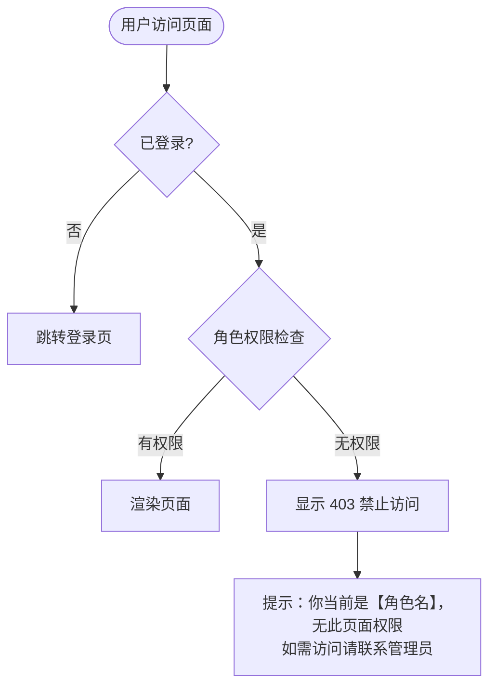
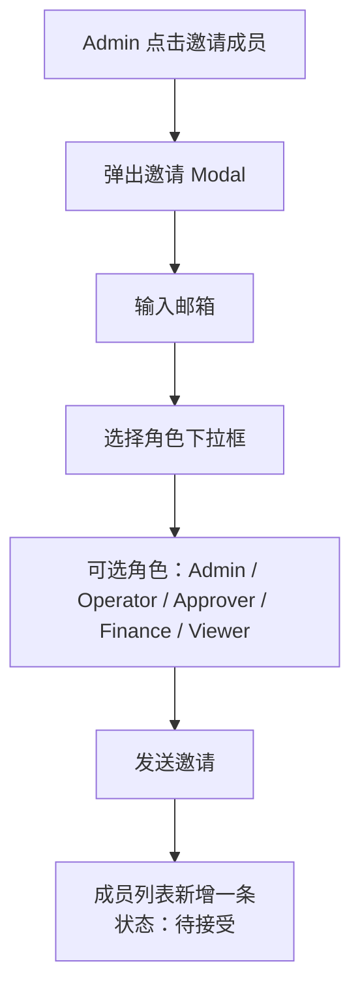

# 权限角色体系 — 产品需求文档（PRD）

> 版本：v1.0 | 更新日期：2026-08-10 | 关联任务：T-PROD-001 | 作者：SaaS-PM

## 一、文档修订记录
| 版本 | 日期 | 修订内容 | 修订人 |
|------|------|----------|--------|
| v1.0 | 2026-08-10 | 初始版本 | SaaS-PM |

## 二、背景与目标

### 2.1 业务背景
AllMall 面向三类客户：个人卖家（1人管1-2店）、品牌团队（3-5人管5-20店）、代运营机构（多人管多客户店铺）。不同角色需要看到不同数据、执行不同操作。产品设计文档定义了 6 个角色，但当前代码仅实现 5 个（缺 Finance），且**所有 5 个角色都能操作任何页面**——Viewer 可以审批、Operator 可以修改系统设置。

**真实运营场景**：
- 代运营机构老板（Owner）不希望运营（Operator）看到客户账单
- 品牌方财务（Finance）只需要看财务报表，不需要碰 Agent 配置
- 实习生（Viewer）只需要看 Dashboard 数据，不应接触审批

### 2.2 产品目标
1. 补齐 Finance 角色（6 角色完整）
2. 全站路由级权限拦截，Viewer 只读、Operator 不可改设置、Finance 仅财务
3. 成员管理页可分配 5 个可选角色（Owner 不可被分配，自动为团队创建者）

### 2.3 当前缺陷（代码实测）
| 缺陷 | 当前表现 | 影响 |
|------|----------|------|
| Finance 角色不存在 | `domain.ts` Member.role 仅 5 个类型 | 财务人员无角色可分配 |
| 无权限拦截 | Viewer 可打开 `/settings/billing`、`/agents/*`、审批等全部页面 | 数据安全形同虚设 |
| 角色显示不一致 | 产品文档 6 角色 vs 代码 5 角色 vs i18n 5 角色 | 产品与代码脱节 |
| 邀请 Modal 角色列表少 1 个 | `MembersSettingsPage` roleOptions 仅 Admin/Operator/Approver/Viewer | 缺 Finance |

## 三、用户角色

| 角色 | 职责概述 | 使用频率 | 关注点 |
|------|----------|:--:|------|
| **Owner** | 店铺所有者，全局管控 | 中 | 所有数据、订阅与账单、成员管理、删除店铺 |
| **Admin** | 管理员，团队运营负责人 | 高 | 店铺/Agent/任务管理、成员邀请、审批 |
| **Operator** | 运营人员，日常执行 | 高 | 管理自己负责的店铺、创建执行任务、处理异常 |
| **Approver** | 审批人，审核把关 | 中 | 审批高风险操作，不创建任务 |
| **Finance** | 财务人员 | 低 | 仅查看财务台账、管理订阅与发票 |
| **Viewer** | 只读观察者 | 低 | 查看 Dashboard 和报表，不可操作 |

## 四、权限矩阵（6 角色 × 核心操作）

| 操作 | Owner | Admin | Operator | Approver | Finance | Viewer |
|------|:--:|:--:|:--:|:--:|:--:|:--:|
| 查看 Dashboard | ✅ | ✅ | ✅ | ✅ | ✅ | ✅ |
| 管理店铺（增删改） | ✅ | ✅ | ❌ | ❌ | ❌ | ❌ |
| 配置 Agent | ✅ | ✅ | ✅ | ❌ | ❌ | ❌ |
| 创建/执行任务 | ✅ | ✅ | ✅ | ❌ | ❌ | ❌ |
| 审批操作 | ✅ | ✅ | ❌ | ✅ | ❌ | ❌ |
| 查看商品/订单 | ✅ | ✅ | ✅ | ✅ | ❌ | ✅ |
| 管理商品/订单 | ✅ | ✅ | ✅ | ❌ | ❌ | ❌ |
| 查看异常/待办 | ✅ | ✅ | ✅ | ✅ | ❌ | ✅ |
| 处理异常/待办 | ✅ | ✅ | ✅ | ❌ | ❌ | ❌ |
| 管理成员与权限 | ✅ | ✅ | ❌ | ❌ | ❌ | ❌ |
| 模型配置 | ✅ | ✅ | ❌ | ❌ | ❌ | ❌ |
| 通知设置 | ✅ | ✅ | ✅ | ❌ | ❌ | ❌ |
| 审计日志 | ✅ | ✅ | ❌ | ❌ | ❌ | ❌ |
| **财务台账** | ✅ | ✅ | ❌ | ❌ | ✅ | ❌ |
| 管理订阅 | ✅ | ✅ | ❌ | ❌ | ✅ | ❌ |
| 使用说明 | ✅ | ✅ | ✅ | ✅ | ✅ | ✅ |

> **特殊规则**：Owner 为团队创建时自动赋予，不可通过邀请分配。删除团队仅 Owner 可执行。

## 五、业务流程图

### 5.1 页面访问拦截流程



### 5.2 邀请成员流程



## 六、功能需求

### 6.1 功能列表
| 编号 | 功能名称 | 优先级 | 说明 |
|------|----------|:--:|------|
| F-001 | domain.ts 新增 Finance 角色类型 | P0 | 类型系统补齐 |
| F-002 | i18n 新增 Finance 角色翻译 | P0 | 中英文案 |
| F-003 | 邀请 Modal 角色下拉新增 Finance | P0 | MembersSettingsPage |
| F-004 | AppShell 路由级角色拦截 | P0 | 每个路由校验当前用户角色 |
| F-005 | 403 禁止访问页面 | P0 | 无权限时展示 |
| F-006 | 导航菜单按角色显隐 | P1 | 无权限的菜单项灰显或隐藏 |

### 6.2 功能详细说明

#### F-001：domain.ts 新增 Finance 角色类型

- **功能描述**：在 `MemberRole` 类型联合中新增 `'Finance'`
- **当前代码**（`src/types/domain.ts` 约第 115 行）：
  ```typescript
  export type MemberRole = 'Owner' | 'Admin' | 'Operator' | 'Approver' | 'Viewer';
  ```
- **修改为**：
  ```typescript
  export type MemberRole = 'Owner' | 'Admin' | 'Operator' | 'Approver' | 'Finance' | 'Viewer';
  ```

#### F-002：i18n 新增 Finance 角色翻译

- **文件**：`src/app/i18n.tsx` 的 `zh` 和 `en` 字典
- **新增 key**：`member.role.Finance`
- **zh 值**：`"财务"`
- **en 值**：`"Finance"`
- **同时补充** `mvpRoles` 数组中的 Finance 角色描述：
  - zh: `"仅查看财务台账，管理订阅"`
  - en: `"View financial ledger, manage subscriptions"`

#### F-003：邀请 Modal 角色下拉新增 Finance

- **文件**：`src/pages/settings/MembersSettingsPage.tsx`
- **当前 roleOptions**（仅 4 个选项：Admin/Operator/Approver/Viewer）
- **修改**：在 roleOptions 数组中插入 Finance 选项，位于 Approver 和 Viewer 之间
- **下拉展示顺序**：Admin → Operator → Approver → Finance → Viewer

#### F-004：AppShell 路由级角色拦截

- **功能描述**：每个页面路由在渲染前检查当前用户角色是否有访问权限
- **实现方式**：利用已有的 `RoleGuard` 组件（`src/components/RoleGuard.tsx`），为每个路由配置允许的角色列表
- **路由-角色映射表**：

| 路由 | 允许的角色 | 说明 |
|------|-----------|------|
| `/dashboard` | 全部 6 角色 | 所有人可看经营总览 |
| `/inbox` | Owner, Admin, Operator, Approver | 需要处理待办的角色 |
| `/inbox?type=approval` | Owner, Admin, Approver | 仅审批相关角色 |
| `/orders` | Owner, Admin, Operator | 运营相关 |
| `/products` | Owner, Admin, Operator | 运营相关 |
| `/agents/*` | Owner, Admin, Operator | Agent 配置 |
| `/setup` | Owner, Admin, Operator | 自动化配置 |
| `/stores/*` | Owner, Admin | 店铺管理 |
| `/stores/onboarding` | Owner, Admin | 店铺入驻 |
| `/settings/members` | Owner, Admin | 成员管理 |
| `/settings/models` | Owner, Admin | 模型配置 |
| `/settings/notifications` | Owner, Admin, Operator | 通知设置 |
| `/settings/audit-logs` | Owner, Admin | 审计日志 |
| `/settings/billing` | **Owner, Admin, Finance** | 财务台账（Finance 核心页面） |
| `/settings/guide` | 全部 6 角色 | 帮助文档 |

- **前置条件**：用户已登录，`useAuth()` 返回当前用户角色
- **异常流程**：用户访问无权限路由 → 显示 403 页面（F-005），不显示导航菜单

#### F-005：403 禁止访问页面

- **触发条件**：用户角色不匹配路由所需角色
- **页面内容**：
  - 图标：锁或禁止符号
  - 标题："暂无访问权限"
  - 说明文字："你当前的角色是【{角色中文名}】，无权访问此页面。如需访问请联系团队管理员（Owner 或 Admin）申请权限变更。"
  - 操作按钮："返回首页"（跳转 `/dashboard`）
- **注意**：403 页面不展示侧边栏导航（使用无导航布局），避免用户通过导航发现其他无权限页面

#### F-006：导航菜单按角色显隐（P1）

- **功能描述**：侧边栏菜单项根据当前用户角色动态显隐
- **显隐规则**：
  - `/settings/billing`：仅 Owner, Admin, Finance 可见
  - `/settings/members`：仅 Owner, Admin 可见
  - `/settings/models`：仅 Owner, Admin 可见
  - `/settings/audit-logs`：仅 Owner, Admin 可见
  - 其余菜单项：全部角色可见（无权限时点击后显示 403）
- **注意**：隐藏规则比拦截规则更宽松——宁可看到一个"无权访问"的页面，也不要在导航里消失导致用户困惑"功能去哪了"

## 七、SaaS 权限矩阵

| 功能 | 免费版 | 标准版 | 企业版 |
|------|:--:|:--:|:--:|
| 6 角色体系 | 仅 Owner + Viewer | 全部 6 角色 | 全部 6 角色 + 自定义角色 |
| 路由权限拦截 | ✅ | ✅ | ✅ |
| 成员数量上限 | 3 人 | 20 人 | 无限制 |
| 审计日志（成员维度） | ❌ | ✅ | ✅ |

## 八、版本围栏

| 功能 | 免费版 | 标准版 | 企业版 |
|------|--------|--------|--------|
| 角色数量 | 2 个（Owner + Viewer） | 6 个全角色 | 6 个 + 可自定义 |
| 成员上限 | 3 人 | 20 人 | 无限制 |
| 权限拦截 | 基础拦截（仅区分 可操作/只读） | 完整 6 角色拦截 | 完整 + 自定义规则 |

> **免费版限制说明**：免费版仅支持 Owner（团队创建者自动）和 Viewer（可邀请只读用户查看数据），不开放 Admin/Operator/Approver/Finance 角色。当用户尝试邀请第 4 个成员时触发升级引导。

## 九、交互说明

### 9.1 邀请成员 Modal（修改后）
- **触发**：成员管理页「邀请成员」按钮
- **Modal 内容**：
  - 邮箱输入框（必填，含格式校验）
  - **角色下拉框**：Admin / Operator / Approver / Finance / Viewer（新增 Finance）
  - 发送邀请按钮
- **成功反馈**：Toast "已向 xxx@example.com 发送邀请"
- **角色下拉旁提示**：每个角色旁显示一句话职责说明
  - Admin："管理店铺、Agent、成员和团队设置"
  - Operator："管理负责的店铺，创建和执行任务"
  - Approver："仅审核高风险操作，不可创建任务"
  - **Finance**："仅查看财务台账，管理订阅与发票"（新增）
  - Viewer："仅查看数据，不可操作"

### 9.2 403 页面
- **布局**：居中，无侧边栏
- **视觉**：
  - 顶部：锁图标（灰色，大尺寸）
  - 中间："暂无访问权限"（一级标题）
  - 说明文字：动态带角色名
  - 底部：「返回首页」按钮（主色）
- **示例文案**："你当前的角色是**运营人员**，无权访问此页面。如需访问请联系团队管理员申请权限变更。"

### 9.3 状态流转
```
用户点击菜单 → 路由检查 → 角色匹配？ → 是：正常渲染页面
                                    → 否：显示 403 页面
```

## 十、验收标准

| 编号 | 验收项 | 验收条件 | 优先级 |
|------|--------|----------|:--:|
| AC-001 | Finance 角色可分配 | 邀请成员时下拉框含"财务"选项，选择后可成功发送邀请 | P0 |
| AC-002 | 成员列表显示 Finance | 成员列表页显示"财务"角色标签 | P0 |
| AC-003 | Viewer 无法访问 Agent 配置 | 以 Viewer 登录，访问 `/agents` 显示 403 | P0 |
| AC-004 | Viewer 无法访问财务台账 | 以 Viewer 登录，访问 `/settings/billing` 显示 403 | P0 |
| AC-005 | Operator 无法访问成员管理 | 以 Operator 登录，访问 `/settings/members` 显示 403 | P0 |
| AC-006 | Finance 可访问财务台账 | 以 Finance 登录，`/settings/billing` 正常显示 | P0 |
| AC-007 | Finance 无法访问 Agent 配置 | 以 Finance 登录，`/agents` 显示 403 | P0 |
| AC-008 | Owner 可访问所有页面 | 以 Owner 登录，所有页面正常访问 | P0 |
| AC-009 | 邀请 Finance 成功 | Admin 邀请 finance@allmall.com 角色选"财务"，列表新增一条 | P0 |
| AC-010 | i18n 中英文完整 | 切换语言后，邀请 Modal 角色名跟随切换 | P1 |

## 十一、产品风险

| 编号 | 风险描述 | 影响范围 | 严重度 | 缓解措施 |
|------|----------|----------|:--:|----------|
| R-001 | 权限拦截遗漏子路由 | 全局 | 中 | 以 `router.tsx` 完整路由表为基准逐条校验 |
| R-002 | 现有 Mock 数据无 Finance 角色用户 | 测试验证 | 低 | 在 loginAccounts 中新增 Finance 角色的演示账号 |
| R-003 | 历史硬编码角色判断逻辑可能遗漏更新 | 全局 | 中 | Grep 全项目搜索 `'Owner' \| 'Admin' \| 'Operator'` 等字符串，逐处更新 |
