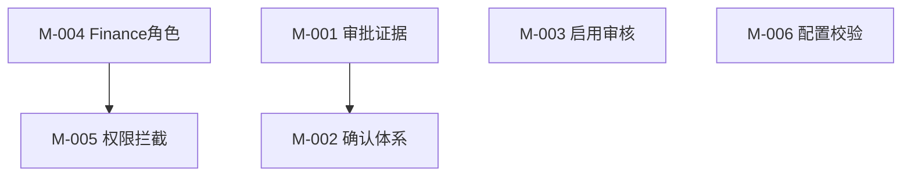

# PMO 项目规划：AllMall 信任修复与产品闭环

> 版本：v1.0 | 更新日期：2026-08-10 | 关联任务：T-PROD-001

## 一、模块拆解

### 1.1 模块总览
| 编号 | 模块名称 | 功能概述 | 依赖 | 复杂度 |
|------|----------|----------|------|:--:|
| M-001 | 审批证据真实化 | 修复审批详情页 beforeValue/afterValue 伪造问题 | 无 | 低 |
| M-002 | 高危操作确认体系 | 退款/放行/审批通过/驳回加确认弹窗+原因记录 | 无 | 中 |
| M-003 | Agent 启用审核 | 一键启用改为逐 Agent 勾选审核 Modal | 无 | 中 |
| M-004 | Finance 角色补齐 | domain.ts → MembersSettingsPage → i18n 全链路加 Finance | 无 | 低 |
| M-005 | 角色权限拦截 | AppShell 加 RoleGuard 路由拦截，6 角色权限矩阵 | M-004 | 中 |
| M-006 | 策略配置校验 | 表单输入边界校验 + 保存反馈 | 无 | 低 |

### 1.2 依赖关系

## 二、MoSCoW 优先级

### 2.1 Must Have（本期必做 — P0）
| 编号 | 模块 | 理由 |
|------|------|------|
| M-001 | 审批证据真实化 | 当前伪造数据，演示即穿帮 |
| M-002 | 高危操作确认体系 | 退款/放行无确认等于事故制造机 |
| M-003 | Agent 启用审核 | 一键全开高风险 Agent 无提示，用户"感觉失控" |
| M-004 | Finance 角色补齐 | 产品设计 6 角色 vs 代码 5 角色，不一致 |

### 2.2 Should Have（本期应做 — P0/P1）
| 编号 | 模块 | 理由 |
|------|------|------|
| M-005 | 角色权限拦截 | 依赖 M-004，安全底线 |
| M-006 | 策略配置校验 | 成本低，影响面小 |

### 2.3 Won't Have（本期不做）
| 编号 | 模块 | 理由 |
|------|------|------|
| - | 商品 SPU+铺货 P1 | 独立模块，另开任务 T-PROD-002 |
| - | 店铺智能化第二轮 | 独立模块，另开任务 T-PROD-003 |

## 三、迭代划分

### 3.1 迭代规划
| 迭代 | 目标 | 包含模块 | 交付物 |
|------|------|----------|--------|
| Sprint-1 | 信任修复 | M-001 + M-002 + M-003 + M-006 | 4 个模块代码合并 + 功能验证 |
| Sprint-2 | 权限体系 | M-004 + M-005 | Finance 角色 + 全站权限拦截 |

### 3.2 里程碑
| 里程碑 | 标志事件 | 验收标准 |
|--------|----------|----------|
| M1 | Sprint-1 完成 | 审批详情显示真实数据、退款需确认、一键启用展示 Agent 清单 |
| M2 | Sprint-2 完成 | 6 角色可选、Viewer 无法操作管理页面 |

## 四、风险清单
| 编号 | 风险 | 影响模块 | 等级 | 概率 | 应对 |
|------|------|----------|:--:|:--:|------|
| R-001 | RoleGuard 路由拦截可能遗漏深层子路由 | M-005 | 中 | 中 | 以 router.tsx 完整路由表为校验基准 |
| R-002 | 确认弹窗改动可能影响已有审批流程 | M-002 | 低 | 低 | 仅影响 UI 层，不改变审批状态机 |

## 五、执行原则
- **先修破窗**：M-001/M-002 最高优先，演示中穿帮的 Bug 先修
- **每个 Sprint 独立可验证**：不依赖后端即可完成前端闭环验证
- **最小改动**：不重构，只修问题点
