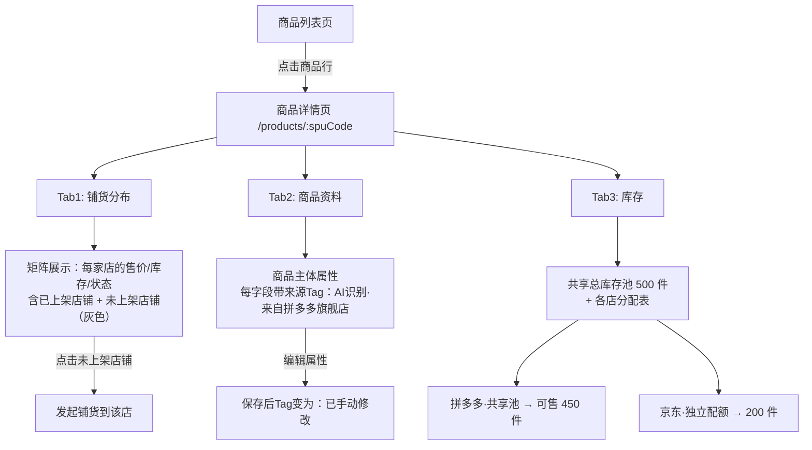
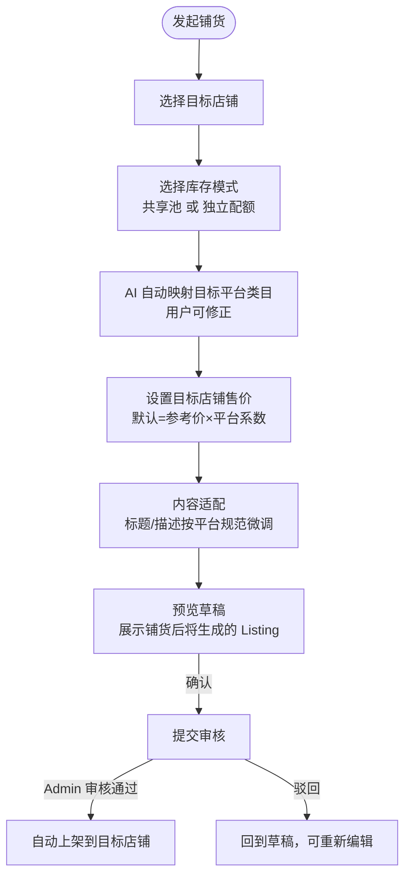

# 商品 SPU+铺货 P1 — 产品需求文档（PRD）

> 版本：v1.0 | 更新日期：2026-08-10 | 关联任务：T-PROD-001 | 作者：SaaS-PM

## 一、文档修订记录
| 版本 | 日期 | 修订内容 | 修订人 |
|------|------|----------|--------|
| v1.0 | 2026-08-10 | 初始版本，覆盖 P1 范围 | SaaS-PM |

## 二、背景与目标

### 2.1 业务背景（真实运营场景）

**场景一：多店铺卖家查看商品分布**
> 卖家李总在拼多多、淘宝、京东各开了一家店。同一款"iPhone 防摔手机壳"在三家店都上了架，但拼多多卖 ¥19.9（走量）、淘宝卖 ¥29.9（品质路线）、京东卖 ¥35.9（含运费险）。现在他想知道：这款手机壳在三个平台的销售情况分别如何？库存够不够？哪个平台该补货了？

当前产品现状：商品列表一行=一个店铺的上架记录，同一款手机壳在三个店铺显示为三行。李总无法一眼看出"三个店卖的是同一件东西"，也无法对比跨店表现。

**场景二：代运营机构铺货到新店**
> 代运营小张刚帮客户接通了一家新的京东店铺。客户的 1200 个商品已经在拼多多和淘宝有售。小张需要把其中 30 个爆款商品批量铺到京东新店——但需要先确认京东的类目映射、设置京东专属售价、选择库存模式。

当前产品现状：铺货功能未实现，只能手动逐商品在新店重新上架。

### 2.2 产品目标（P1 范围）
1. **商品详情页三个 Tab**：铺货分布 / 商品资料 / 库存 — 一个页面看清一件商品跨所有店铺的全貌
2. **铺货到店铺流程**：从商品详情页一键发起，复用开店向导的类目映射和内容适配能力
3. **同步入口**：列表页顶部工具条显示同步状态，支持手动触发同步

### 2.3 P0 已有基础（本期不改）
- 两层类型定义：`Product`(SPU) + `ProductListing`(铺货记录)
- Mock 数据含跨多店、含未上架店铺的样例
- 主列表一行一主体 + 铺货 chips 列 + 展开矩阵 + KPI 重定义
- 商品列表页 `ProductManagementPage` 已按 D6 重构

## 三、用户角色

| 角色 | 职责概述 | 使用频率 | 关注点 |
|------|----------|:--:|------|
| **Operator** | 运营人员，日常执行商品管理和铺货 | 高 | 快速查看跨店分布、批量铺货到新店、库存健康度 |
| **Admin** | 管理员，审核铺货草稿 | 中 | 审核铺货内容、确认类目映射、批准上架 |
| **Viewer** | 观察者 | 低 | 只读查看商品跨店表现，不可操作 |

## 四、业务流程图

### 4.1 商品详情页 — 三 Tab 浏览



### 4.2 铺货到店铺流程



## 五、功能需求

### 5.1 功能列表
| 编号 | 功能名称 | 优先级 | 说明 |
|------|----------|:--:|------|
| F-001 | 商品详情页 — 铺货分布 Tab | P0 | per-store 完整矩阵 |
| F-002 | 商品详情页 — 商品资料 Tab | P1 | 主体属性 + 来源 Tag + 可编辑 |
| F-003 | 商品详情页 — 库存 Tab | P1 | 总池可视化 + 各店分配表 |
| F-004 | 铺货到店铺流程 | P0 | 选店 → 类目映射 → 售价 → 预览 → 提交 |
| F-005 | 同步状态条 | P1 | 列表页顶部的同步时间 + 待同步数 |

### 5.2 功能详细说明

---

#### F-001：铺货分布 Tab

- **功能描述**：以店铺为行、以关键字段为列，展示该商品在所有店铺的上架情况，包括已上架和未上架的店铺
- **路由**：`/products/:spuCode`（已有，复用 ProductDetailPage）

- **页面结构**：
  - Header：商品主图缩略图 + 名称 + 货号 + 来源Tag（`AI识别·来自拼多多旗舰店` 或 `已手动修改`）
  - 三个 Tab 切换：「铺货分布」「商品资料」「库存」
  - 默认展示：铺货分布 Tab

- **铺货分布 Tab 具体内容**（以商品 "SPU-001：iPhone 防摔手机壳" 为例）：

  **已上架店铺矩阵**：

  | 店铺 | 状态 | 售价 | 库存模式 | 当前库存 | 平台SKU | 上架时间 | 7天销量 | 操作 |
  |------|------|------|----------|:--:|------|----------|:--:|------|
  | 拼多多旗舰店 | ✅ 已上架 | ¥19.90 | 共享总池 | 可售 450 | PD123456789 | 2026-07-15 | 326 单 | 编辑 · 下架 |
  | 淘宝专营店 | ✅ 已上架 | ¥29.90 | 共享总池 | 可售 450 | TB987654321 | 2026-07-20 | 158 单 | 编辑 · 下架 |
  | 京东旗舰店 | 🔄 草稿审核中 | ¥35.90 | 独立配额 200 | 配额 200 | — | 待审核 | — | 编辑 · 取消 |

  **未上架店铺（建议铺货）**：

  | 店铺 | 状态 | 建议操作 |
  |------|------|----------|
  | 抖音小店 | ⬜ 未上架 | **「铺货到此店」** 按钮（主色 CTA） |
  | TikTok Shop | ⬜ 未上架 | **「铺货到此店」** 按钮（主色 CTA） |

  - **未上架店铺来源**：系统自动计算：商家有连接的店铺集合 − 已有 listing 记录的店铺集合
  - **点击「铺货到此店」**：触发 F-004 铺货流程，预填目标店铺

  **跨店汇总小卡片**（矩阵上方）：
  - 已铺货 3/5 店铺
  - 总库存 700 件（共享池 500 + 独立配额 200）
  - 7天总销量 484 单
  - 售价区间 ¥19.90 – ¥35.90

- **异常流程**：
  - 商品无任何 listing → 显示 "该商品尚未铺货到任何店铺"，下方列出所有可用店铺 +「铺货」CTA
  - 所有 listing 均已下架 → 矩阵全显示「已下架」，汇总卡片变灰

---

#### F-002：商品资料 Tab

- **功能描述**：展示商品主体的完整属性，每个字段标注数据来源
- **前置条件**：商品已存在主体数据（自动同步或手动创建）

- **属性列表**（以 SPU-001 为例）：

  | 属性 | 当前值 | 来源 | 是否可编辑 |
  |------|--------|------|:--:|
  | 商品名称 | iPhone 15 Pro Max 防摔硅胶手机壳 全包保护 | `AI识别·来自拼多多旗舰店` | ✅ 可编辑 |
  | 货号(SPU) | SPU-001 | `手动创建` | ❌ 不可编辑 |
  | 主图 | [商品图片缩略图] | `AI识别·来自拼多多旗舰店` | ✅ 可替换 |
  | 类目 | 手机配件 > 手机壳/保护套 | `AI识别·来自拼多多旗舰店` | ✅ 可编辑 |
  | 成本价 | ¥8.50/件 | `手动修改` | ✅ 可编辑 |
  | 商品描述 | 液态硅胶材质，四角气囊防摔，精准孔位... | `AI识别·来自拼多多旗舰店` | ✅ 可编辑 |
  | 品牌 | 无品牌 | `来自淘宝专营店` | ✅ 可编辑 |
  | 主店铺 | 拼多多旗舰店（GMV 最高） | `系统自动` | ✅ 可切换 |

- **来源 Tag 说明**：
  - `AI识别·来自[店铺名]`：属性值由 AI 从对应店铺同步数据中识别提取，自动播种
  - `已手动修改`：用户手动修改后锁定，后续同步不覆盖此字段
  - `系统自动`：由系统规则自动计算（如主店铺按 GMV 最高）

- **编辑交互**：
  - 点击可编辑字段 → 内联编辑（in-place edit）或打开编辑表单
  - 保存后：来源 Tag 立即从「AI识别·来自XX」变为「已手动修改」🔒
  - 锁定字段不再被同步覆盖，除非用户手动「重置为同步值」

- **业务规则**：
  - 货号不可修改（作为归并的主键）
  - 修改主店铺会触发提示："切换主店铺后，未手动修改的属性将更新为新主店铺的值"
  - 至少保留 1 张主图

---

#### F-003：库存 Tab

- **功能描述**：可视化展示共享总库存池和各店铺的库存分配情况
- **前置条件**：商品至少有一条 listing

- **页面布局**（以 SPU-001 为例）：

  **共享总库存池**（顶部大卡片）：
  ```
  ┌─────────────────────────────────────────────┐
  │  📦 共享总库存池                              │
  │                                              │
  │  总库存  500 件                               │
  │  ████████████████████████████████░░░░  90%    │
  │  已分配 450 件  |  安全库存 50 件  |  可分配 0 件 │
  │                                              │
  │  库存状态：⚠️ 库存紧张（低于安全库存线）         │
  └─────────────────────────────────────────────┘
  ```

  **各店分配表**：

  | 店铺 | 库存模式 | 分配/配额 | 当前可售 | 已售(7天) | 库存状态 |
  |------|----------|:--:|:--:|:--:|:--:|
  | 拼多多旗舰店 | 🔗 共享池 | — | 450（扣减中） | 326 | ⚠️ 偏低 |
  | 淘宝专营店 | 🔗 共享池 | — | 450（扣减中） | 158 | ✅ 充足 |
  | 京东旗舰店 | 📌 独立配额 | 200 件 | 200 | — | ✅ 充足 |

- **操作**：
  - 共享池（低库存时）：「调整库存」按钮 → 输入新总量
  - 独立配额行：「调整配额」按钮 → 修改该店专属配额数量

- **业务规则**：
  - 共享池可售 = 总库存 − 安全库存 − 已锁定订单量
  - 独立配额可售 = 配额数量
  - 库存低于安全库存线 → 库存状态标红 + 列表页对应商品行库存列显示红点

---

#### F-004：铺货到店铺流程

- **功能描述**：将一个已有商品主体铺货到新的目标店铺，生成一条新的 ProductListing 草稿
- **触发入口**：
  - 铺货分布 Tab 中未上架店铺行的「铺货到此店」
  - 商品列表展开行中未上架店铺的「铺货」
  - 商品详情页 Header 右侧「铺货到店铺」按钮

- **流程步骤**（5 步 Wizard，复用 StoreOnboardingPage 的步骤组件）：

  **Step 1：选择目标店铺**
  ```
  ┌─────────────────────────────────────────────┐
  │  选择目标店铺                                 │
  │                                              │
  │  ○ 抖音小店（已连接）                          │
  │  ○ TikTok Shop（已连接）                       │
  │                                              │
  │  预填：如果从铺货分布未上架行点击，自动选中     │
  └─────────────────────────────────────────────┘
  ```

  **Step 2：库存模式**
  ```
  ┌─────────────────────────────────────────────┐
  │  选择库存模式                                 │
  │                                              │
  │  ○ 共享总池（推荐）                           │
  │    与其他店铺共用总库存，跨店防超卖             │
  │                                              │
  │  ○ 独立配额                                   │
  │    为此店铺划出专属库存配额：[____] 件          │
  │    当前池内可用：500 件                        │
  └─────────────────────────────────────────────┘
  ```


  **Step 3：类目映射**
  ```
  ┌─────────────────────────────────────────────┐
  │  目标平台类目映射                              │
  │                                              │
  │  源类目：手机配件 > 手机壳/保护套               │
  │  ↓ AI 自动映射                                │
  │  抖音小店类目：3C数码配件 > 手机保护套 > 硅胶壳  │
  │                                              │
  │  [可点击修正，弹出类目树选择器]                 │
  │  置信度：高 ✅                                 │
  └─────────────────────────────────────────────┘
  ```

  **Step 4：售价与内容适配**
  ```
  ┌─────────────────────────────────────────────┐
  │  售价设置                                     │
  │  建议售价（抖音平台系数 0.95）：¥28.41          │
  │  手动调整：[____] 元                           │
  │                                              │
  │  标题适配（抖音规范：≤30字）                    │
  │  iPhone防摔硅胶手机壳全包保护                   │
  │  [可编辑]                                     │
  │                                              │
  │  描述适配                                     │
  │  液态硅胶材质，四角防摔...                     │
  │  [可编辑]                                     │
  └─────────────────────────────────────────────┘
  ```

  **Step 5：预览确认**
  ```
  ┌─────────────────────────────────────────────┐
  │  铺货预览                                     │
  │                                              │
  │  商品：iPhone 防摔硅胶手机壳（SPU-001）         │
  │  目标店铺：抖音小店                             │
  │  类目：3C数码配件 > 手机保护套 > 硅胶壳         │
  │  售价：¥28.41                                 │
  │  库存模式：共享总池                             │
  │                                              │
  │  提交后将生成一条【草稿】状态的铺货记录，         │
  │  需要管理员审核通过后自动上架。                  │
  │                                              │
  │  [确认提交]  [返回修改]                        │
  └─────────────────────────────────────────────┘
  ```

- **提交后**：
  - 生成一条 `ProductListing`，状态 = `draft`（草稿，待审核）
  - 铺货分布 Tab 中该店铺行状态变为「🔄 草稿审核中」
  - Admin 在待办中心「商品」筛选项中看到该草稿，可审核通过/驳回
  - 通过后自动上架：状态变为 `listed`，记录上架时间

- **异常流程**：
  - 类目映射置信度 < 60% → 提示用户手动选择类目，不允许自动映射
  - 共享池库存不足 → 提示"共享池仅剩 X 件，建议选择独立配额或先补充库存"
  - 目标店铺未连接 → 先引导连接店铺，再回到铺货流程

---

#### F-005：同步状态条

- **功能描述**：商品列表页顶部工具条显示上次同步时间和待同步变更数量
- **位置**：列表页工具栏区域，KPI 卡片下方、表格上方

- **展示内容**：
  ```
  ┌──────────────────────────────────────────────────────────┐
  │  🔄 上次同步：2026-08-10 14:30 · 3 个商品有更新待同步      [立即同步] │
  └──────────────────────────────────────────────────────────┘
  ```

- **状态变体**：
  - 正常态："上次同步：XX分钟前 · 无待同步变更"（绿色图标）
  - 有待同步："上次同步：XX · 3 个商品有更新待同步"（橙色图标 + 数字）
  - 同步中："正在同步..."（加载动画 + 禁用按钮）
  - 从未同步："尚未同步商品数据"（红色图标 +「立即同步」CTA）
  - 同步失败："上次同步失败，2小时前 · 点击重试"（红色图标）

## 六、SaaS 权限矩阵

| 功能 | Owner | Admin | Operator | Approver | Finance | Viewer |
|------|:--:|:--:|:--:|:--:|:--:|:--:|
| 查看商品详情（三Tab） | ✅ | ✅ | ✅ | ❌ | ❌ | ✅ |
| 编辑商品资料 | ✅ | ✅ | ✅ | ❌ | ❌ | ❌ |
| 调整库存 | ✅ | ✅ | ✅ | ❌ | ❌ | ❌ |
| 发起铺货 | ✅ | ✅ | ✅ | ❌ | ❌ | ❌ |
| 审核铺货草稿 | ✅ | ✅ | ❌ | ❌ | ❌ | ❌ |
| 手动同步 | ✅ | ✅ | ✅ | ❌ | ❌ | ❌ |

## 七、版本围栏

| 功能 | 免费版 | 标准版 | 企业版 |
|------|--------|--------|--------|
| 商品详情三Tab | ✅ | ✅ | ✅ |
| 铺货到店铺 | 手动逐商品 | 手动逐商品 | 批量铺货（一次选多商品到多店） |
| 同步 | 手动触发 | 手动触发 + 每6小时自动 | 手动 + 每1小时自动 |
| 类目映射 | AI 自动映射 | AI 自动映射 + 映射历史 | AI 自动 + 自定义映射规则 |

## 八、交互说明

### 8.1 商品详情页入口
- **从商品列表**：点击商品行 → 跳转 `/products/:spuCode`
- **从 Dashboard**：点击 TOP5 商品排名的商品名 → 跳转详情页

### 8.2 页面结构
- Header：商品缩略图 + 名称 + 货号 + 来源Tag + [铺货到店铺] 按钮
- Tab 栏：铺货分布 | 商品资料 | 库存
- 默认激活：「铺货分布」Tab

### 8.3 关键交互

| 交互点 | 触发方式 | 系统响应 |
|--------|----------|----------|
| 点击未上架店铺的「铺货到此店」 | 点击按钮 | 打开铺货 Wizard，Step1 预填该店铺 |
| 编辑商品属性 | 点击字段旁的编辑图标 | 内联编辑 / 弹窗编辑 |
| 来源Tag从AI变为手动 | 保存编辑 | Tag 文字变化 + 出现锁图标 |
| 提交铺货预览 | 点击「确认提交」 | Toast "已提交铺货草稿，等待审核" + 回到铺货分布 Tab |
| 调整库存 | 点击「调整库存/配额」 | 弹窗输入新数量 → 保存 |

## 九、验收标准

| 编号 | 验收项 | 验收条件 | 优先级 |
|------|--------|----------|:--:|
| AC-001 | 铺货分布 Tab 正确展示 | 包含已上架店铺矩阵 + 未上架店铺建议列表 | P0 |
| AC-002 | 未上架店铺自动计算 | 未上架 = 已连接店铺 − 有 listing 店铺 | P0 |
| AC-003 | 点击「铺货到此店」启动 Wizard | Step1 自动选中目标店铺 | P0 |
| AC-004 | 铺货 Wizard 5 步走通 | 选店 → 库存模式 → 类目映射 → 售价 → 预览 → 提交 | P0 |
| AC-005 | 提交后生成草稿 listing | 铺货分布中该店状态变「草稿审核中」 | P0 |
| AC-006 | 商品资料 Tab 带来源 Tag | 每个字段标注 AI识别/已手动修改/系统自动 | P1 |
| AC-007 | 编辑资料后 Tag 变「已手动修改」+ 锁 | 编辑保存后来源 Tag 正确变化 | P1 |
| AC-008 | 库存 Tab 展示总池 + 分配表 | 进度条 + 各店模式 + 库存状态 | P1 |
| AC-009 | 同步状态条显示正确状态 | 四种状态均正确渲染 | P1 |
| AC-010 | 类目映射置信度低时手动选择 | < 60% 时不允许自动映射 | P1 |

## 十、产品风险

| 编号 | 风险描述 | 影响范围 | 严重度 | 缓解措施 |
|------|----------|----------|:--:|----------|
| R-001 | 铺货 Wizard 与开店向导复用可能导致耦合 | 开发效率 | 中 | 抽离 Step 组件为独立可复用模块 |
| R-002 | 类目映射准确性依赖 AI，可能出错 | 用户体验 | 中 | 置信度 < 60% 强制人工确认 |
| R-003 | 共享池库存扣减逻辑复杂度 | 数据一致性 | 低 | Mock 阶段先做简单减法，不做事务锁 |
